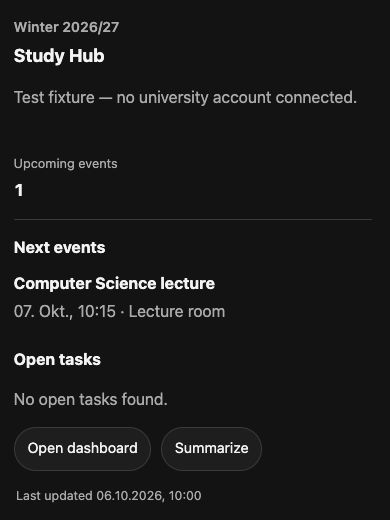
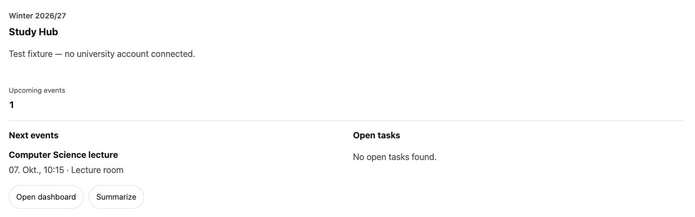

# ChatGPT widget design

Reviewed against OpenAI's current [UI guidelines](https://developers.openai.com/plugins/concepts/ui-guidelines)
and [UI integration reference](https://developers.openai.com/plugins/reference)
on 6 October 2026.

## Design choices

- Use host-provided color, font, radius, and focus tokens. Honor initial theme
  and subsequent MCP Apps host-context updates, plus ChatGPT compatibility events.
- Use the platform system font. Do not load custom fonts or a UI framework.
  OpenAI's component library is optional; this widget stays vanilla TypeScript.
- Keep surfaces neutral. Use the existing brand accent on primary actions,
  with neutral text, dividers, and structural labels. Remove decorative shadows.
- Use a consistent 4/8/12/16/24px spacing scale at the default root font size.
  Keep controls at least 44px tall at that size, with visible keyboard focus.
- Show the inline study overview as a compact snapshot: metrics, two upcoming
  events, two open tasks, and two bottom actions. Keep every existing panel in
  fullscreen. Do not add dashboard navigation tabs to the inline card.
- Change display mode only after the host confirms it. Explain denial instead
  of pretending the widget entered fullscreen. Declare supported modes in
  initialization and resource metadata.
- Let cards grow with their content and report intrinsic height changes to the
  host. Remove fixed minimum heights and internal vertical scrolling. Allow
  horizontal scrolling for wide module tables; keep tags wrapped.
- Use one-column dashboard cards on narrow screens. Let filter controls wrap
  and preserve filters after an error. Preserve explicit empty/error states.
- Show Alma source-page section labels as metadata, not apparent interactive tabs.
- Keep CSS files below 300 lines and serve minified local assets. Version the
  changed resource URIs as v9 while retaining existing resource aliases.

## Verification

Type check, build, and 58 ChatGPT tests pass. Focused regressions cover host theme
and token updates, partial context updates, foreign-frame rejection, and actual
host-confirmed display modes, including denial.

Local iframe previews checked light/dark appearance, a 390px inline overview,
a 1280px desktop overview, mobile one-column fullscreen layout, confirmation
content, and empty Mensa filters. The mobile inline view and Mensa filters had
no horizontal overflow. Browser interaction with offscreen fullscreen controls
was unreliable in the local embedded-browser harness; do not treat this as a
complete mobile interaction test. Actual ChatGPT integration remains unverified.

The minified JS and CSS total 60,152 bytes, about 19% below the original
74,712-byte total. This is raw payload size, not an end-to-end latency measurement.

Test fixtures, not a connected university account:

